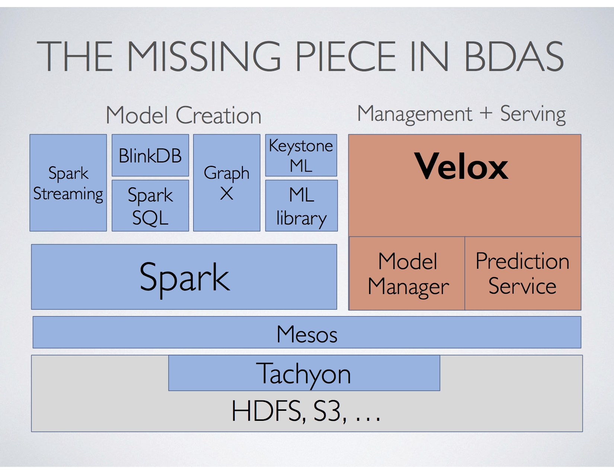

##Velox Model Server

[](https://amplab.cs.berkeley.edu/jenkins/job/velox%20testing/)

#VELOX

Velox is a system for serving machine learning predictions.

+ Supports real-time personalized predictions
+ Integration with [Spark](spark.apache.org) and [KeystoneML](keystone-ml.org)
+ Automatic model training in batch and online




##Quickstart

Installing Velox using the provided scripts requires [`fabric`](http://www.fabfile.org/installing.html) >= 1.10.0 and dependencies (Paramiko >= 1.10.0)

Install and start Velox:

```
git clone https://github.com/amplab/velox-modelserver.git
cd velox-modelserver/bin/cluster
pip install fabric
fab install_velox_local:~/
fab start_velox:start_local=y
```

This start a local Velox instance listening on localhost at port 8080.

You can interact with the Velox REST API using cURL.

```
curl -H "Content-Type: application/json" -d '{"context": 4, "uid":1000}' http://localhost:8080/predict/matrixfact
curl -H "Content-Type: application/json" -d '{"context": 4, "uid":4, "score":1.3}' http://localhost:8080/observe/matrixfact
curl http://localhost:8080/retrain/matrixfact
```

For more details and a guide to deploying Velox on a cluster, check out our [deployment guide](docs/deployment_guide.md).

##Contact

+ Mailing list: velox-modelserver@googlegroups.com
+ crankshaw@cs.berkeley.edu

## Contributing to Velox

We are actively seeking comments and contributions through Github. Please file a Github issue with any bugs or feature requests.
If you'd like to contribute code, please submit Github Pull Request for review and merging.

## Additional resources

+ [CIDR paper](http://arxiv.org/abs/1409.3809)
+ [Tech talk](http://www.slideshare.net/dscrankshaw/velox-at-sf-data-mining-meetup)
+ [Video](https://www.youtube.com/watch?v=rESINg9lfGY) and [slides](http://www.slideshare.net/dscrankshaw/veloxampcamp5-final) from presentation at AMPCamp 5

##License

Velox is under the Apache 2.0 [License](LICENSE).


__More documentation coming soon__
